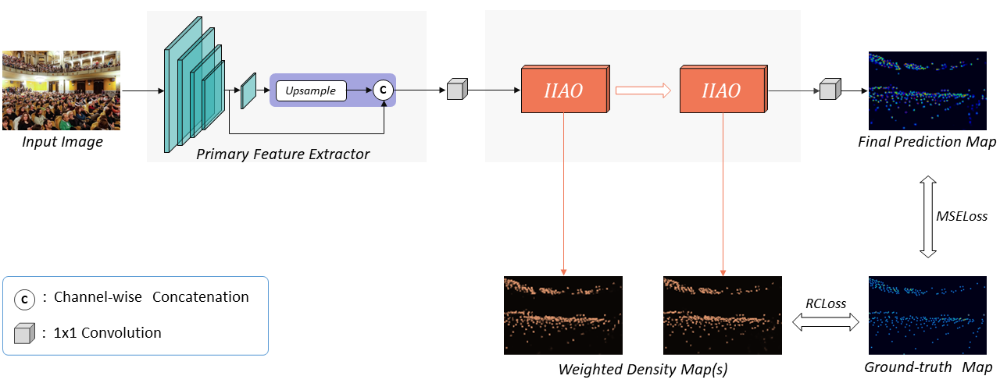
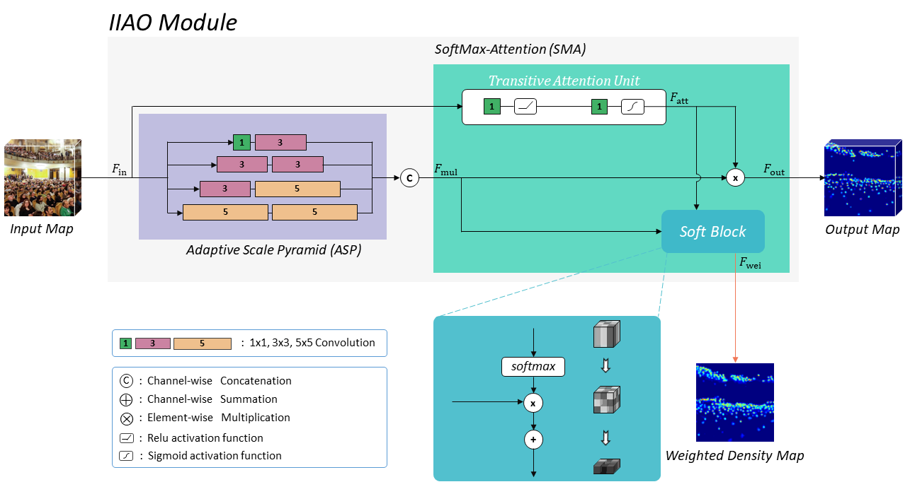
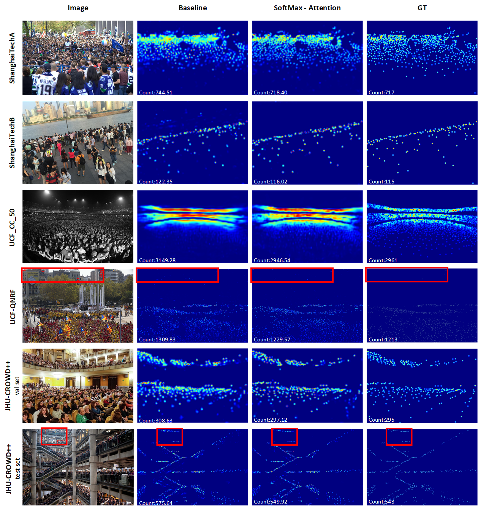

#  IIAO

Official implementation of the paper **Indirect-Instant Attention Optimization for Crowd Counting in Dense Scenes**. 


<br>

## The network

### 1. Overall architecture




<br>

<br>

### 2. IIAO module




<br>

<br>

<br>


## Getting Started

### 1. Preliminary Preparation

- Clone this repo into a directory.

  ```
  git clone https://github.com/han-suyu/IIAO.git
  ```

  

- Python version is 3.7.0, install its dependencies under anaconda.

  ```
  pip install -r requirements.txt
  ```

  

<br>

 <br>

### 2. Preparing the model

Download one of the JHU-CROWD++ models.

- Download model (**Overall-val**)  from [GoogleDrive ](https://drive.google.com/file/d/16zrsUGeyK3bq1TUHUlK16Ra1zVYR1x5s/view?usp=sharing) and place it in directory `./checkpoint`

- Download model (**Overall-test**)   from [GoogleDrive ](https://drive.google.com/file/d/1icPfEIY6RDvNs2n-4odivE5E46QGe6p9/view?usp=sharing) and place it in directory `./checkpoint`


<br>

<br>

### 3. Preparing the dataset

#### step 1：

Download dataset  JHU-CROWD++ from [official website ](https://drive.google.com/drive/folders/1FkdvHyAom1B2aVj6_jZpZPW01sQNiI7n) and place it in directory `./datasets`.

#### step 2：

Run `txt2mat.py` to convert the labels from `txt` format to `mat` format. You can check the `check_mat` folder to check the conversion effect.

#### step 3：

Run `mat2h5.py` to convert the labels from `mat` format to `h5` format. You can check the `check_density` folder to check the conversion effect.

#### step 4：

Run `split.py` to divide the samples into four categories according to the density level: **Overall** (Original), **High**, **Medium**, **Low**. Each category contains three parts: **train**, **val**, and **test**.

<br>

#### Final structure of JHU-CROWD++ dataset

```
datasets
    └─jhu_crowd_v2.0
        ├─High
        │  ├─test
        │  │  ├─mats
        │  │  └─images
        │  ├─train
        │  │  ├─mats
        │  │  └─images
        │  └─val
        │      ├─mats
        │      └─images
        ├─Low
        │  ├─test
        │  │  ├─mats
        │  │  └─images
        │  ├─train
        │  │  ├─mats
        │  │  └─images
        │  └─val
        │      ├─mats
        │      └─images
        ├─Medium
        │  ├─test
        │  │  ├─mats
        │  │  └─images
        │  ├─train
        │  │  ├─mats
        │  │  └─images
        │  └─val
        │      ├─mats
        │      └─images
        └─Overall
            ├─test
            │  ├─mats
            │  └─images
            ├─train
            │  ├─mats
            │  └─images
            └─val
                ├─mats
                └─images
```

<br>

<br>

### 4. Test

Run the following command to launch test:

```
python jhu-test.py --level Overall --mode val

...

python jhu-test.py --level Low --mode test
```

> `level` optional: Overall, High, Medium, Low
>
> `mode` optional: val, test


<br>

<br>

<br>


## Visualized results



<br>

<br>

<br>


## References

[SFANet](https://github.com/pxq0312/SFANet-crowd-counting)

[SASNet](https://github.com/TencentYoutuResearch/CrowdCounting-SASNet)